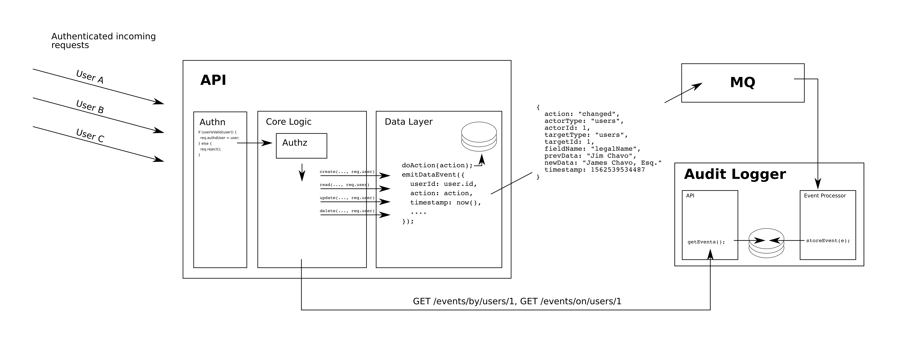

Audit Logging Proof of Concept
==================================================================

This is a mono-repo that contains three services that together represent a minimal (and very quick-and-dirty) proof of concept for a system for auditing-logging data events.

The goal was to create a system that's relatively painless to use for the following purposes:

1. producing the desired data mutation events (view, create, update, delete);
2. persisting these data events without bogging down the system producting them; and
3. querying these data events in the context of either the "actor" or the "target" object (i.e., see what a given user has done, or see who has done what to a given object).

## What to Ignore

I'd like to make it clear right up front that this was a very quick-and-dirty proof of concept. Here's what NOT to pay attention to:

1. The front end (`/packages/website/*`). This is an unprincipled scramble to give the user a feel for the value of the back-end system.
2. JSON:API typings. I used this as yet another attempt to clarify my thoughts on how to do JSON:API typings. I got some value out of that, but these types should not be thought of as valuable in their own right.
3. The (not-)security mechanisms. I created a "tokens" endpoint to simply give us a JWT that we can use to simulate an OAuthed connection.
4. The structure of the user objects. Again, this was a POC.

## What to Pay Attention To

1. The structure of the [`DataEventAttributes`](packages/audit-types/src/index.ts#L78) and related. This represents the essential data that makes this system function effectively, and is used for everything from the MQ messages to storage in the DB to retrieval via the API.
2. The general architecture (see below).

## Architecture

The above diagram demonstrates more or less the main ideas of the system.

* We have an API that authenticates ALL requests.
* We have a core application logic layer that authorizes the requests and forwards them to either the data layer or another API[1].
* We have a user-aware, event emitting data layer.
* We have a service that catches and logs all data events.
* That same service, can then be queried for events related to a specific actor or target object.

In the system in this repo, the "primary API" is listening at 3000, the audit logger service is on 3001, and the front end is on 3002.

[1] Note that this have the API work as a reverse proxy over the audit logging API is not really an intentional design decision so much as a convention I've begun to lean on to solve the problem of having a single authn/authz layer. This diagram doesn't split that out, but in reality the authn/authz layer would probably be a separate service in front of the APIs, and the "main" API and audit logging API would more resemble peers below that, rather than parent/child.

